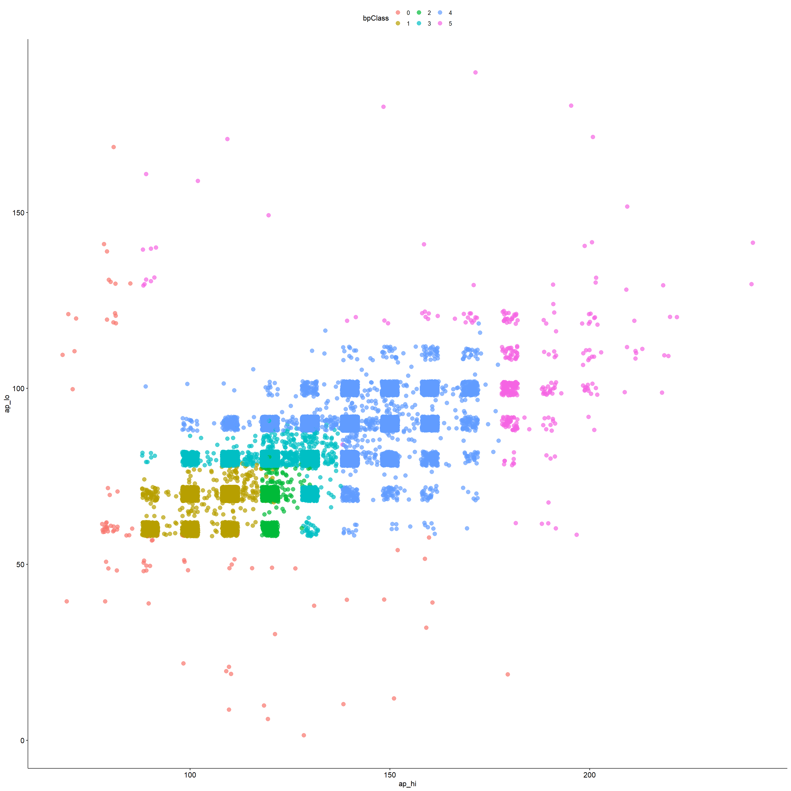

```{r setup, include=FALSE}
library(GGally)
library(randomForest)
library(caret)
library(tidyverse)
set.seed(1234)

# Use set dplyr fxns as priority for conflicts
library(conflicted)
conflict_prefer("select", "dplyr")
conflict_prefer("filter", "dplyr")
```


# Let's do some exercises using a Cardiovascular dataset!
> https://www.kaggle.com/datasets/sulianova/cardiovascular-disease-dataset

## Ex 1: Data overview

### Ex 1.1: Read in the data

1) Go to the provided link: https://www.kaggle.com/datasets/sulianova/cardiovascular-disease-dataset for a description the dataset and its features.
2) Read in the cardio dataset into your R session

```{r}
knowingYourData_Filepath <- "C:/Users/S438187/Desktop/Wu Lab/Other Projects/Comp Bio/UTSWNanocourse2024_Data Science in R_student/data/cardio_small.csv"
cardio <- read_csv(knowingYourData_Filepath)
```

### Ex 1.2: Get familiar with your dataset

1) Look at the structure of your dataset

2) Look at the first 7 values and the last 5 values.

3) Look at the number, size, and data type of each column
(You may need to change some of these!)

4) Get summary statistics for your dataset
(Do all of the values make sense?)

5) Check for missing values

```{r}
# Look at the structure of your dataset

#Look at the head of the dataset
cardio %>% head()

#Look at last 5 values

#Look at number, size, and data type of each column

# Print the summary statistics
cardio %>% summary()

# Check for missing values:
print(any(is.na(cardio)))
#No missing values

```

### Ex 1.3: Do some basic plotting of your datset
1) make a pair plot for your dataset
  - Are there any features which seem to have the wrong datatype? Are there any heavily skewed features?
2) make a corr plot for your dataset.
  - Are there any highly correlated features? Should any of these be removed?

Bonus: Add color based on one of your categorical variables
(This dataset is relatively big, so don't be surprised if this takes a minute or two)

```{r, fig.height=18, fig.width = 18, message = FALSE, warning = FALSE}

```


```{r, fig.height=18, fig.width = 18, message = FALSE, warning = FALSE}

```

### Ex 1.4: Validating your columns

1) Fix your datatypes if any columns have inappropriate data types

2) Drop duplicate features if any are present in your dataset 

3) Using techniques in Ex1.2, double-check to make sure your changes make sense.

```{r}

```

## Ex 2: Detailed Cleaning  

After taking a first look at your data, you likely have realized that there may be some problems!

### Ex 2.1: Taking a closer look at ap_hi and ap_lo


1) Interpret the plot above, what does this tell you about your data?

2) Bonus: Reproduce the plot
- Hint: geom_violin() and geom_jitter() may prove useful

```{r}

```


### Ex 2.2: Cleaning ap_hi/ap_lo:

1) Try to clean the data
- Using your existing knowledge and/or what you can quickly google, impose some reasonable bounds on ap_hi and ap_low

Hint: 
- Try using a combination of plotting and dplyr::filter() to see how a filter changes the distribution of your data without overwriting your dataset.

2) Check how your filter impacted the dataset size using techniques in Ex1.2 

```{r}

```

### Ex 2.3: Taking a closer look at age

1) Create a new column which contains the age of each person in years

2) Plot the age of each person as a histogram (set the binwidth = 1)

3) What does this distribution tell you about your data?

- Are there any diversity sampling issues?  

- Do you think a predictive model trained on this data would generalize well?


```{r}


```

### Ex 2.4: Cleaning Related Features   

Below I've provided a plot of ap_hi vs. ap_lo colored by blood pressure classification (bpClass)


https://www.heart.org/en/health-topics/high-blood-pressure/understanding-blood-pressure-readings



1) What (if anything) is odd/surprising about this plot?

2) What (if anything) can you do to fix it?


### Ex 2.5: Apply what you've learned! 

Apply what you've learned to clean height and weight!

```{r, fig.height=18, fig.width = 18}

```

```{r, fig.height=18, fig.width = 18}


```


### Ex: 2.6: Create your own new feature!

- You could do a categorical binning (as shown above) for blood pressure classification

- You could do a numerical combination such as creating BMI from height and weight

- You could come up with something completely different!

```{r, fig.height=18, fig.width = 18, message = FALSE, warning = FALSE}

```

## Ex 3: Building the predictive model

### Ex: 3.1: Train/test splitting

1) Split your dataset into a training and testing set

Bonus: Can you recall why this is important?

```{r}


```

### Ex: 3.2: Feature selection and scaling

1) Subset your dataset to only features you think will be useful for the predictive model

2) Scale your continuous variables

3) Do we scale our continous variables before or after splitting into training and test sets? Why?

```{r}


```

### Ex: 3.3: Model set up (Classifier)

1) Set up a random forest classifier for whether or not the patient has cardio vascular disease

2) Generate predictions for your both your training and test dataset

```{r}

```

### Ex 3.4: Evaluate your model

1) Look at your trained model summary in the console

2) Plot it

3) Extract and plot the variable importance

4) Create 2 confusion matrices. One for your training and one for your test data

5) (Optional) Is there anything you found surprising about your results?

```{r}


```

### Ex: 3.5: Diagnosing a model's performance

A random forest model has been trained to predict bpClass and its results have been reproduced for you below: 

`rfClassifier2`

>#### Call:
#### randomForest(formula = bpClass ~ ., data = train, ntree = 4) 
####                Type of random forest: classification
####                      Number of trees: 4
#### No. of variables tried at each split: 3
####          OOB estimate of  error rate: 5.23%

Confusion matrix:

(col) Predicted Class |0  |  1  | 2  |   3 |   4 |  5 | class.error
----------------------|---|-----|----|-----|-----|----|------------
0                     | 18|   17|   2|    3|    5|   0|  0.60000000
1                     | 19| 2131|  43|   53|    8|   0|  0.05456965
2                     |  3|   43| 622|   72|    6|   0|  0.16621984
3                     |  1|   51|  75| 7646|  108|   1|  0.02994164
4                     |  5|    6|  11|  255| 5044|  26|  0.05666729
5                     |  0|    0|   0|    5|   46| 181|  0.21982759

`plot(rfClassifier2)`


`varImp(rfClassifier2)`

Feature     |  Overall
------------|----------
age         |    280.43907
bmi         |    271.15817
height      |    170.14556
weight      |    218.60556
ap_hi       |    4583.66647
ap_lo       |    6065.35525
gender      |    27.55451
cholesterol |    90.26142
gluc        |    42.68689
smoke       |    18.21242
alco        |    11.03999
active      |    27.05405
cardio      |    605.06250

`varImpPlot(rfClassifier2)`


1) Identify what issues (if any) there are with this model.  What would you do (if anything) to make the model "better"?


# BONUS exercises!

### Ex: 4.1: Model set up (Regression)

1) Set up a random forest regression in order to predict the patient's bmi

2) Generate predictions for your both your training and test dataset

```{r}

```

### Ex 4.2: Evaluate your model

1) Look at your trained model

2) Plot it

3) Extract and plot the variable importance

4) (Optional) Is there anything you found surprising about your results?

```{r}

```


### Ex 4.3: Try to create a better model!

Using what you've learned, attempt to make a better model.

This can be done by leaving out features, making new features, further cleaning of the data, etc.

Have fun!

