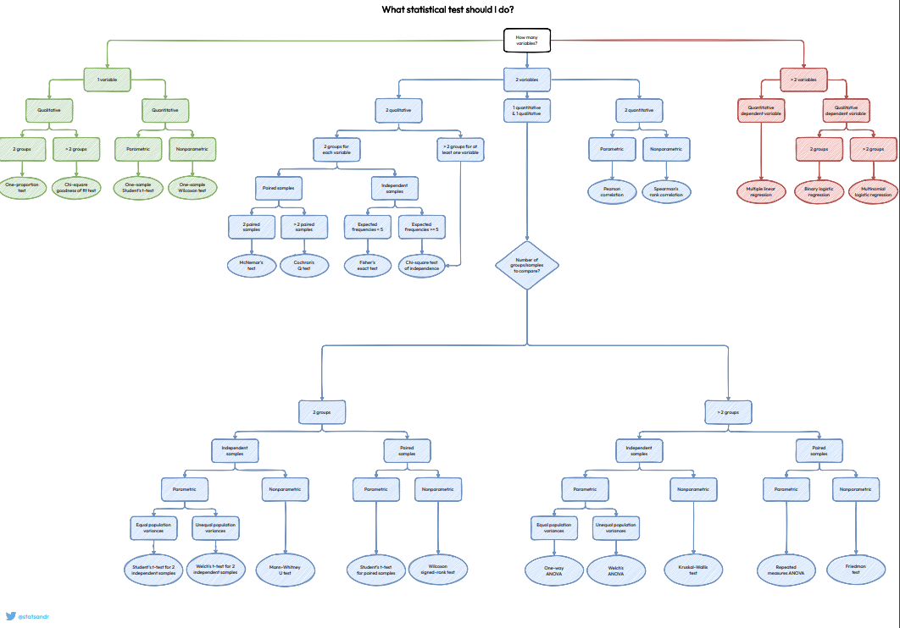
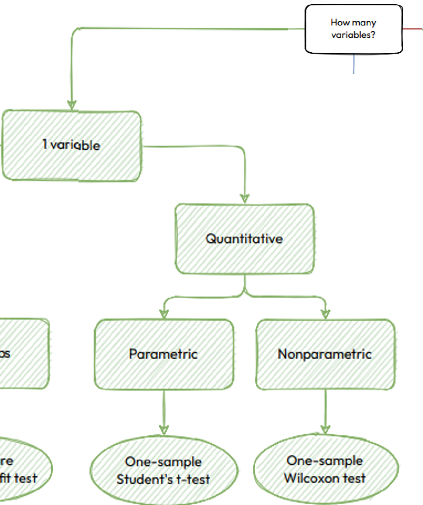
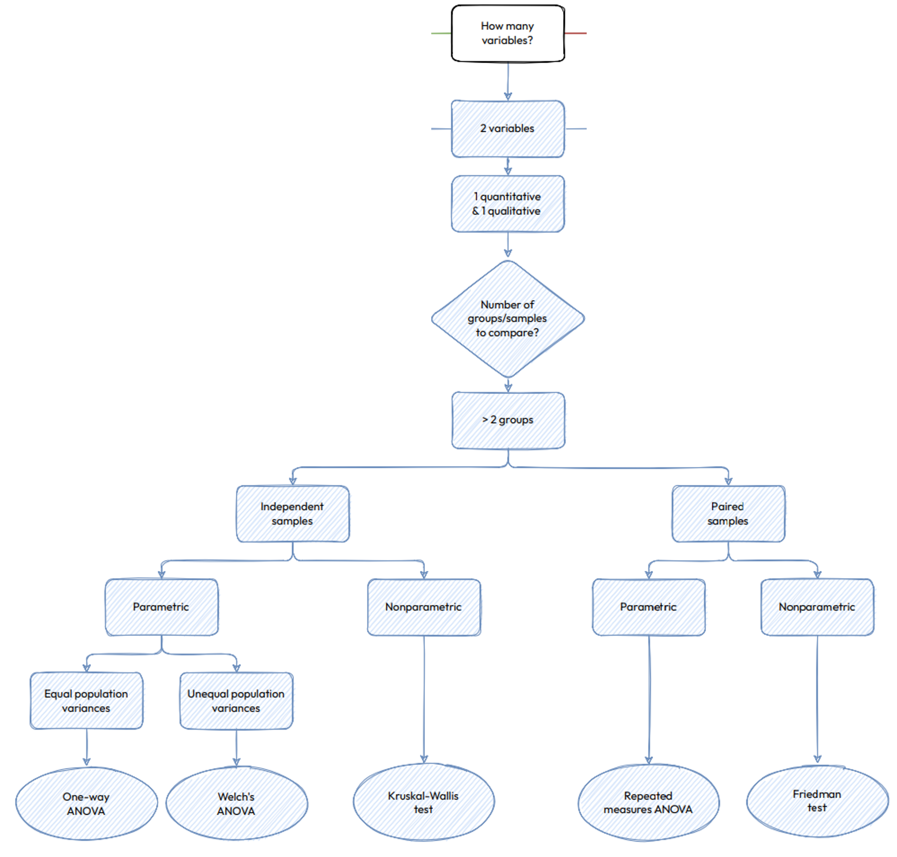
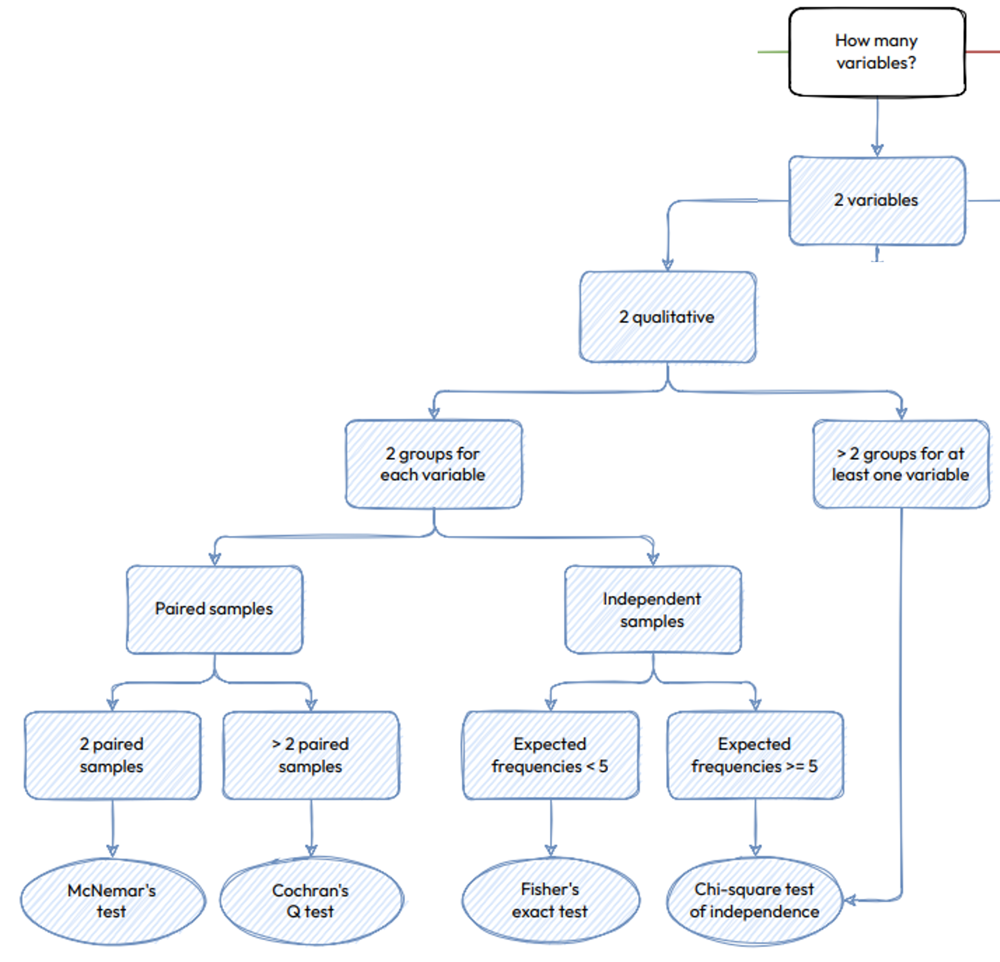

```{r setup, include=FALSE}
library(datasets)
library(ggpubr)
library(rstatix)
library(GGally)
library(caret)
library(MASS)
library(titanic)
library(tidyverse)
library(cowplot)
set.seed(1234)

# Use set dplyr fxns as priority for conflicts
library(conflicted)
conflict_prefer("select", "dplyr")
conflict_prefer("filter", "dplyr")


# Dataset setup

df <- tibble(datasets::iris)

df_se <- df %>% filter(Species == "setosa")
df_ve <- df %>% filter(Species == "versicolor")
df_vi <- df %>% filter(Species == "virginica")

# make a paired dataset
df_se_paired <- df_se %>% 
  select(Sepal.Length) %>%
  mutate(Sepal.Length.Winter = Sepal.Length - rnorm(length(df_se$Sepal.Length), mean = 0.1, sd = 0.05)) %>% 
  mutate(flowerID = row_number())

df_se_rm  <- df_se %>% 
  select(Sepal.Length) %>%
  mutate(Winter = Sepal.Length - rnorm(length(df_se$Sepal.Length), mean = 0.1, sd = 0.05)) %>% 
  mutate(Summer = Sepal.Length - rnorm(length(df_se$Sepal.Length), mean = 0, sd = 0.01)) %>% 
  mutate(flowerID = row_number()) %>%
  rename(Spring = Sepal.Length) %>% 
  pivot_longer(cols = -flowerID, names_to = 'season', values_to = 'Sepal.Length')

# Randomly select some flowers to grow on the mountain
mountainFlowers <-sample(nrow(df_se), 10)
rainforestFlowers <- sample(nrow(df_se), 12)

# Make the seasons and locations
sl  <- df_se %>% 
  select(Sepal.Length) %>%
  mutate(Winter = Sepal.Length - rnorm(length(df_se$Sepal.Length), mean = 0.2, sd = 0.05)) %>% 
  mutate(Summer = Sepal.Length + rnorm(length(df_se$Sepal.Length), mean = 0, sd = 0.2)) %>% 
  mutate(flowerID = row_number(), loc = ifelse(flowerID %in% rainforestFlowers, 'rainforest', ifelse(flowerID %in% mountainFlowers, 'mountain', 'valley'))) %>%
  rename(Spring = Sepal.Length) %>% 
  pivot_longer(cols = -c(flowerID, loc), names_to = 'season', values_to = 'Sepal.Length')

sw  <- df_se %>% 
  select(Petal.Width) %>%
  mutate(Winter = Petal.Width - rnorm(length(df_se$Petal.Width), mean = 0, sd = 0.01)) %>% 
  mutate(Summer = Petal.Width - rnorm(length(df_se$Petal.Width), mean = 0.5, sd = 0.01)) %>% 
  mutate(flowerID = row_number(), loc = ifelse(flowerID %in% rainforestFlowers, 'rainforest', ifelse(flowerID %in% mountainFlowers, 'mountain', 'valley'))) %>%
  rename(Spring = Petal.Width) %>% 
  pivot_longer(cols = -c(flowerID, loc), names_to = 'season', values_to = 'Petal.Width')

sl$Petal.Width <- sw$Petal.Width

df_2wayANOVA <- sl

# Add some summer and winter mods
df_2wayANOVA <- df_2wayANOVA %>% 
  group_by(flowerID) %>%
  mutate(Sepal.Length = ifelse(season == 'Winter' & loc == 'mountain', Sepal.Length - rnorm(1, mean = 1.0, sd = 0.05), Sepal.Length)) %>%
  mutate(Sepal.Length = ifelse(season == 'Winter' & loc == 'rainforest', Sepal.Length + rnorm(1, mean = 0.2, sd = 0.05), Sepal.Length)) %>%
  mutate(Sepal.Length = ifelse(loc == 'rainforest', Sepal.Length + rnorm(1, mean = 0.5, sd = 0.05), Sepal.Length)) %>% 
  mutate(Sepal.Length = ifelse(loc == 'mountain', Sepal.Length - rnorm(1, mean = 0.2, sd = 0.05), Sepal.Length)) %>% 
  ungroup()

# Add country 
df_2wayANOVA <- df_2wayANOVA %>% 
  group_by(flowerID) %>% 
  mutate(country = sample(c('USA', 'Canada'), 1, replace = TRUE), Mean.Sepal.Length = mean(Sepal.Length)) %>% 
  ungroup() %>% 
  transform(country = as_factor(country), loc = as_factor(loc), season = as_factor(season)) 

# 2 Way anova independent measures
df_2wayANOVA_indep <- df_2wayANOVA %>% group_by(flowerID) %>% select(loc, Mean.Sepal.Length, country) %>% unique() %>% ungroup()

# Add a bunch of noise to make a non-parametric dataset
df_np <- df_2wayANOVA %>%
  group_by(season, loc) %>% 
  mutate(Sepal.Length = Sepal.Length - runif(1, min = 0, max = 3) + rpois(1, lambda = 3) - rbinom(1, size = 1, 0.543)) %>% ungroup() %>%
  group_by(flowerID) %>%
  mutate(Mean.Sepal.Length = mean(Sepal.Length)) %>%
  ungroup()

# Paired wilcoxon
df_pairedWilcox <- df_np %>% filter(season != 'Spring') %>% select(flowerID, season, Sepal.Length) %>% transform(flowerID = as_factor(flowerID), season = factor(season, levels = c('Summer', 'Winter'))) 

# regular wilcoxon
df_se_np <- df_np %>% select(-Sepal.Length, -Petal.Width, -season, -loc) %>% unique() 
df_se_np <- df_se_np %>% mutate('Species' = 'setosa') %>% rename(Sepal.Length = Mean.Sepal.Length )
df_wilcox <- df_se_np %>% 
  bind_rows(df_ve %>% select(Species, Sepal.Length)) %>% select(-flowerID) 

# Kruskal Wallis
summerdf <- df_np %>% filter(season == 'Summer') %>% mutate(Sepal.Length = Sepal.Length - rbinom(50, 1, 0.4)*runif(50, 0, 3)) %>% select(flowerID, loc, Sepal.Length) %>% transform(flowerID = as_factor(flowerID), loc = factor(loc)) 

# Friedman
df_friedman <- df_np %>% select(flowerID, season, Sepal.Length) %>% transform(flowerID = as_factor(flowerID), season = as_factor(season))

# Chi-squared
ti <- titanic_train %>% as_tibble() %>% select(Name, Sex, Pclass, Survived) %>% drop_na() %>% transform(Name = as_factor(Name), Sex = as_factor(Sex), SES = as_factor(Pclass), Survived = as_factor(Survived)) %>% select(-Pclass)


# https://rpkgs.datanovia.com/rstatix/reference/cochran_qtest.html
# each participant undergoes all 3 treatments
df_cochran <- data.frame(
  outcome = c(0,1,1,0,0,1,0,1,1,1,1,1,0,0,1,1,0,1,0,1,1,0,0,1,0,1,1,0,0,1),
  treatment = gl(3,1,30,labels=LETTERS[1:3]),
  participant = gl(10,3,labels=letters[1:10])
)
df_cochran$outcome <- factor(df_cochran$outcome, levels = c(1,0), labels = c('improved', 'unimproved'))

df_cochran <- df_cochran %>% as_tibble()


df_se %>% head() 
df_ve %>% head()
df_vi %>% head()
df_se_paired %>% head()
df_se_rm %>% head()
df_2wayANOVA %>% head()
df_np %>% head()
df_pairedWilcox %>% head()
df_se_np %>% head()
df_wilcox %>% head()
summerdf %>% head()
df_2wayANOVA_indep %>% head()

```

# Section Outline:

By the end of this section you should be able to:

1) Validate your data meets assumptions for various hypothesis tests
- Independence of samples
- Normality assumption
- equal variances
- Check for outliers

2) Perform appropriate statistical test in R

Although not comprehensive, we will cover what (in my opinion) are the most common.

**Normal, Continuous variables:**

- t-test
  - one sample
  - two sample
  - paired two sample

- Wilcoxon rank-sum (Mann-Whitney U)
  - one sample
  - two sample
  - paired two sample

- ANOVA
  - One-way ANOVA
  - Two-way ANOVA
  - Repeated measures ANOVA
  
**Normal, Continuous, Non-homogeneous variance:**

- Welch 
  - t-test 
  - ANOVA

**Non-Normal, Continuous:**

- Kruskal-Wallis
- Wilcoxon signed rank
- Friedmann's 

**Multiple comparisions and adjustment: ** 

- pairwise comparisons
  - tukey_hsd
  - games_howell

- q-value (p-value correction for multiple testing)
  - Bonferroni
  - Benjamini-Hochberg

**Discrete, Independent Variables:**

- chi-squared
- Fisher's exact

**Discrete, Repeated Measures:**

- Cochran's Q
- McNemar's 


# Basic Statistics:

## Key Take aways:

https://statsandr.com/blog/files/overview-statistical-tests-statsandr.pdf

(Don't worry if you can't read this, we will go over selective portions later)

1) Know your data type! (for both your Independent and dependent variables)
  - Continuous
    - Is it normally distributed? (i.e. parametric/non-parametric)
  - Discrete
  - Categorical

2) Know the number of groups you want to test!
  - 1  group
  - 2  groups
  - 2> groups
  
3) Are your samples independent or paired?


## Load data / Cursory Examination

I can't stress enough the importance of understanding your data. Before hypothesis testing (or really anything) you should check the integrity of your dataset. Specifically for hypothesis testing, we will check the assumptions of each test and plot the data itself. This may seem repetitive, but it is **essential**.

```{r, fig.height=8, fig.width=8}
# Load data
df <- tibble(datasets::iris)

# Any Missing values?
any(is.na(df))
# What rows contain missing values?
df[!complete.cases(df),]

# Data structure
df %>% str()     # Personally I prefer this one esp. because it has the size of each column
df %>% glimpse()

# Top 10 rows: 
# Note, when working in Rstudio I usually just call the dataframe which prints the top 10 rows by default. However, knitr (the package which converts the rmd to an html) tries to print the whole dataset if I do that, so I will be using head() here.
df %>% head(10) 

# Note: head/tail are particularly useful when used with arrange().  For example, if you arrange your dataset in descending order and check the tail to ensure all values positive.
df %>% arrange(Sepal.Length, descending = FALSE) %>% head(10)
df %>% arrange(Sepal.Length) %>% tail(10)

# Summary Stats
df %>% summary()
df %>% rstatix::get_summary_stats()
```


# Checking your statistical assumptions:

Assumptions:

- Independent samples: Can **NOT** check this in R
  - This is an experimental design issue

- No significant outliers: *Can* check in R
  - rstatix::identify_outliers()

- Normally distributed: *Can* check in R
  - qqplot (recommended)
  - rstatix::shapiro_test()
I recommend only using as a sanity check with small datasets. Only using this method can bias your data.
  - density plot / histogram (good rough estimate)
 
- Homogeneity of variances: *Can* check in R
  - density plot / histogram (good rough estimate)
  - rstatix::levene_test()   (recommended)


## Normality Plotting
```{r, fig.height=7, fig.width=12}
# Density 
df_density <- df %>% 
  pivot_longer(!Species, names_to = "metric", values_to = "value") %>%
  ggplot(aes(x = value, fill = Species)) +
    geom_density(alpha = 0.7) + 
    facet_wrap(~metric) + 
    theme_minimal()

# QQ
df_qq <- df %>% 
  pivot_longer(!Species, names_to = "metric", values_to = "value") %>%
  ggplot(aes(sample = value, color = Species)) +
    geom_qq(alpha = 0.7) + 
    geom_qq_line() +
    facet_wrap(~metric) + 
    theme_minimal()

plot_grid(df_density, df_qq, labels = 'AUTO',ncol = 2)

```

## Normality Testing
```{r, warning=FALSE}
# Shapiro-Wilk normality test
normalityShapiro <- df %>% 
  group_by(Species) %>% 
  summarize(across(.fns = shapiro_test, .names = "{.fn}.{.col}")) %>%
  ungroup() %>% 
  unnest()

normalityShapiro
```

## Transformations

Although the native distribution may not be normal, it is quite common (especially in biological data) for the distribution to be log-normal. So long as you apply the same transformation to all your data, it is still suitable for hypothesis testing. 

A couple common transforms include:

- log
- sqrt
- 1/x
```{r, warning=FALSE, message=FALSE}
df %>% 
  group_by(Species) %>%
  select(Petal.Width) %>%
  mutate('log2(Petal.Width)' = log2(Petal.Width), 'sqrt(Petal.Width)' = sqrt(Petal.Width), '1/(Petal.Width)' = 1/(Petal.Width)) %>%
  summarize(across(.fns = shapiro_test, .names = "{.fn}.{.col}")) %>%
  ungroup() %>% 
  unnest()

```


## Outlier Testing

What is quantitatively an outlier? Common practice is to use relative distance from IQR.

Quick refresher of quantiles and IQR: 

IQR is interquartile range.

If you sort the dataset lowest to highest, then:

- your first quartile (Q1) is going to be the median of lower half of the dataset. 
- your second quartile (Q2 / median) is the median of the whole dataset.
- your third quartile (Q3) is going to be the median of upper half of the dataset

The Interquartile range is defined as `IQR = Q3 - Q1`

Outlier: 

- `Q1 - 1.5*IQR` OR `Q3 + 1.5*IQR`

Extreme outlier:

- `Q1 - 3*IQR` OR `Q3 + 3*IQR`

If you pass your dataset into `rstatix::identify_outliers()`, it will return any outliers and whether or not they are extreme outliers.

```{r}
df %>% 
  group_by(Species) %>%
  identify_outliers(Sepal.Length)
```

### What if I make a transcription error? (say 51 instead of 5.1)
```{r}
df_outlier <- df
df_outlier$Sepal.Length[1] <- 51

df_outlier %>% 
  group_by(Species) %>%
  identify_outliers(Sepal.Length)
```


# Hypothesis testing

We will start with the student's t-test.

## Dataset 1: df_se
```{r}
any(is.na(df_se))
df_se %>% head(10)
df_se %>% str()
df_se %>% summary()

# Outliers: (There should be none)
df_se %>% 
  identify_outliers(Sepal.Length)

# Normality (p > 0.05 means can assume normal distribution)
df_se %>% 
  shapiro_test(Sepal.Length)

ggqqplot(df_se, "Sepal.Length")
```


## One sample t-test:



- Is my (normally distributed) group different from a normally distributed value group with a specified mean?

```{r}
t.test(df_se$Sepal.Length, mu = 3)
```


## Dataset 2: df_ve
```{r}
any(is.na(df_ve))
df_ve %>% head(10)
df_ve %>% str()
df_ve %>% summary()

# Outliers: (There should be none)
df_ve %>% 
  identify_outliers(Sepal.Length)

# Normality (p > 0.05 means can assume normal distribution)
df_ve %>% 
  shapiro_test(Sepal.Length)

ggqqplot(df_ve, "Sepal.Length")
```


## Dataset 3: df_vi
```{r}
any(is.na(df_vi))
df_vi %>% head(10)
df_vi %>% str()
df_vi %>% summary()

# Outliers: (There should be none)
df_vi %>% 
  identify_outliers(Sepal.Length)

# Normality (p > 0.05 means can assume normal distribution)
df_vi %>% 
  shapiro_test(Sepal.Length)

ggqqplot(df_vi, "Sepal.Length")
```


## Homogeneity of variance df_ve vs. df_vi:
```{r}
# Plot it: 
# Do the density functions have about the same width?
df %>% 
  filter(Species %in% c('versicolor', 'virginica')) %>%
  ggplot(aes(x = Sepal.Length, fill = Species)) + 
  geom_density(alpha = 0.7) + 
  theme_minimal()

# Test it
df %>% 
  filter(Species %in% c('versicolor', 'virginica')) %>%
  levene_test(Sepal.Length ~ Species)

```

## Two sample t-test:


- Is my (normally distributed) group different from some other (normally distributed) group?
```{r}
t.test(df_ve$Sepal.Length, df_vi$Sepal.Length, var.equal = TRUE)
```

## Dataset 4: df_se_paired
```{r}
any(is.na(df_se_paired))
df_se_paired %>% head(10)
df_se_paired %>% str()
df_se_paired %>% summary()

# Outliers: (There should be none)
df_se_paired %>% 
  identify_outliers(Sepal.Length)

df_se_paired %>% 
  identify_outliers(Sepal.Length.Winter)

# Normality 
## Plotting
df_se_paired_sl_qq <- ggqqplot(df_se_paired, "Sepal.Length")

df_se_paired_slw_qq <- df_se_paired %>% 
  ggplot(aes(sample = Sepal.Length.Winter)) +
    geom_qq(alpha = 0.7) + 
    labs(title = 'Sepal.Length.Winter') +
    geom_qq_line() +
    theme_minimal()

plot_grid(df_se_paired_sl_qq, df_se_paired_slw_qq, labels = 'AUTO', ncol = 2)

# Testing (p > 0.05 means can assume normal distribution)
df_se_paired %>% 
  shapiro_test(Sepal.Length)

df_se_paired %>% 
  shapiro_test(Sepal.Length.Winter)

```

## Homogeneity of variance df_se_paired Spring vs Winter?:
```{r, warning=FALSE}
# Plot it: 
# Do the density functions have about the same width?
df_se_paired %>% 
  pivot_longer(!flowerID, names_to = "metric", values_to = "value") %>%
  ggplot(aes(x = value, fill = metric)) +
    geom_density(alpha = 0.7) + 
    theme_minimal()
  
# Test it
df_se_paired %>%
  pivot_longer(!flowerID, names_to = "metric", values_to = "value") %>%
  levene_test(value ~ metric)

```


## Paired Two sample t-test:

- Is my (normally distributed) group with repeated measurements different from some other (normally distributed) group with repeated measurements?
```{r}
# Correct way:
t.test(df_se_paired$Sepal.Length, df_se_paired$Sepal.Length.Winter, paired = TRUE, var.equal = TRUE)
```

### What happens if you don't pair up your data?
#### (THIS IS THE WRONG WAY)
```{r}
# INCORRECT way:
t.test(df_se_paired$Sepal.Length, df_se_paired$Sepal.Length.Winter, var.equal = TRUE)
```

## ANOVA:



We already explored this dataset so let's jump right into the testing:

### Check if equal Variance
```{r}
df %>% 
  ggplot(aes(x = Sepal.Width, fill = Species)) + 
  geom_density(alpha = 0.7) + 
  theme_minimal()

df %>% 
  levene_test(Sepal.Width ~ Species)

```

```{r}
# ANOVA: Does any IV vary significantly the DV
df %>% 
  anova_test(Sepal.Width ~ Species) 

# Pairwise Comparisons: Which Species have significantly different Sepal.Width
df %>% 
  tukey_hsd(Sepal.Width ~ Species)
```

# Welch hypothesis tests

The Welch-ANOVA and Welch-t-test are what you use when you do not meet the assumption of homoscedasticity (homogeneous variance)

## Homogeneity of variance df_se vs. df_ve:
```{r}
df %>% 
  filter(Species %in% c('setosa', 'versicolor')) %>%
  ggplot(aes(x = Sepal.Length, fill = Species)) + 
  geom_density(alpha = 0.7) + 
  theme_minimal()

df %>% 
  filter(Species %in% c('setosa', 'versicolor')) %>%
  levene_test(Sepal.Length ~ Species)
```

## Welch - Two sample t-test:

```{r}
t.test(df_se$Sepal.Length, df_ve$Sepal.Length)
```

## Testing 3 species for equal variance
```{r}
# Unequal Variance
df %>% 
  ggplot(aes(x = Sepal.Length, fill = Species)) + 
  geom_density(alpha = 0.7) + 
  theme_minimal()

df %>% 
  levene_test(Sepal.Length ~ Species)
```


## Welch - ANOVA
```{r}
# Group Testing
df %>% 
  welch_anova_test(Sepal.Length ~ Species)

# Pairwise-Comparisons
df %>% 
  games_howell_test(Sepal.Length ~ Species)

```


### Repeated Measures Dataset: 
```{r, fig.width = 16, fig.height = 7}
# Overview 
any(is.na(df_se_rm))
df_se_rm %>% head(10)
df_se_rm %>% str()
df_se_rm %>% summary()

## Check assumptions: 

# Outliers: (There should be none)
df_se_rm %>% 
  group_by(season) %>%
  identify_outliers(Sepal.Length)

# Plotting
ggqqplot(df_se_rm, "Sepal.Length", facet.by = 'season')

df_se_rm_qq <- df_se_rm %>% 
  ggplot(aes(x = Sepal.Length, fill = season)) + 
  geom_density(alpha = 0.7) + 
  theme_minimal()

# New plot, recommend for repeated measures:
df_se_rm_lines <- df_se_rm %>%
  ggplot(aes(y = Sepal.Length, x = season, group = flowerID, color = as_factor(flowerID))) +
    geom_point()+ 
    geom_line(alpha = 0.7) +
    theme_minimal() + 
    theme(legend.position = "none")

plot_grid(df_se_rm_qq, df_se_rm_lines, labels = 'AUTO', ncol = 2)

# Normality (p > 0.05 means can assume normal distribution)
df_se_rm %>% 
  group_by(season) %>%
  shapiro_test(Sepal.Length)

# Assumption of sphericity done by repeated measures anova automatically

```


## One-Way Repeated measures ANOVA
```{r}
# Repeated measures ANOVA
rmANOVA <- anova_test(data = df_se_rm, dv = Sepal.Length, wid = flowerID, within = season)
rmANOVA

# Pairwise t-tests:
pwSeason <- df_se_rm %>% pairwise_t_test(Sepal.Length ~ season, paired = TRUE, p.adjust.method = "bonferroni")
pwSeason
```

### What happens if you do a regular anova instead?
#### INCORRECT WAY!!
```{r}
df_se_rm %>% 
  anova_test(Sepal.Length ~ season)

```


# 2 way ANOVA: (Independent measures)
```{r}
# Overview dataset
any(is.na(df_2wayANOVA_indep))
df_2wayANOVA_indep %>% head(10)
df_2wayANOVA_indep %>% str()
df_2wayANOVA_indep %>% summary()

# Outliers: (There should be no extreme outliers)
df_2wayANOVA_indep %>% 
  group_by(country, loc) %>%
  identify_outliers(Mean.Sepal.Length)
```

```{r, fig.height = 15, fig.width = 15}
# Density 
df_2wayANOVA_indep_byseason <- df_2wayANOVA_indep %>% 
  ggplot(aes(x = Mean.Sepal.Length, fill = country)) + 
    geom_density(alpha = 0.7) + 
    theme_minimal()

df_2wayANOVA_indep_byloc <- df_2wayANOVA_indep %>% 
  ggplot(aes(x = Mean.Sepal.Length, fill = loc)) + 
    geom_density(alpha = 0.7) + 
    theme_minimal()

# boxplot
df_2wayANOVA_indep_box <- df_2wayANOVA_indep %>%
  ggplot(aes(y = Mean.Sepal.Length, x = country, fill = country)) +
    geom_boxplot(alpha = 0.7) +  
    geom_jitter(width = 0.2)+ 
    facet_wrap(~loc) + 
    theme_minimal()

# QQ
df_2wayANOVA_indep_qq <- df_2wayANOVA_indep %>% 
  ggplot(aes(sample = Mean.Sepal.Length, color = loc)) +
    geom_qq(alpha = 0.7) + 
    geom_qq_line() +
    facet_wrap(country~loc) +
    theme_minimal()

plot_grid(df_2wayANOVA_indep_byseason, df_2wayANOVA_indep_byloc, df_2wayANOVA_indep_box, df_2wayANOVA_indep_qq, labels = 'AUTO', ncol = 2)


# Normality (p > 0.05 means can assume normal distribution)
df_2wayANOVA_indep %>% 
  group_by(country, loc) %>%
  shapiro_test(Mean.Sepal.Length)


```

```{r}
# How about 2-way
df_2wayANOVA_indep %>% 
  anova_test( Mean.Sepal.Length ~ loc * country) %>%
  get_anova_table() %>%
  adjust_pvalue(method = "bonferroni")

# Pairwise comparisons 
df_2wayANOVA_indep %>% pairwise_t_test(Mean.Sepal.Length ~ loc, p.adjust.method = "bonferroni")


```


# 2 way ANOVA: (2 way mixed anova)

- 1 repeated measures IV, 1 standard IV

```{r}
# Overview dataset
any(is.na(df_2wayANOVA))
df_2wayANOVA %>% head(10)
df_2wayANOVA %>% str()
df_2wayANOVA %>% summary()

# Outliers: (There should be no extreme outliers)
df_2wayANOVA %>% 
  group_by(season, loc) %>%
  identify_outliers(Sepal.Length)
```

```{r, fig.height = 15, fig.width = 15}
# Density 
df_2wayANOVA_byseason <- df_2wayANOVA %>% 
  ggplot(aes(x = Sepal.Length, fill = season)) + 
    geom_density(alpha = 0.7) + 
    theme_minimal()

df_2wayANOVA_byloc <- df_2wayANOVA %>% 
  ggplot(aes(x = Sepal.Length, fill = loc)) + 
    geom_density(alpha = 0.7) + 
    theme_minimal()

# Lines
df_2wayANOVA_lines <- df_2wayANOVA %>%
  ggplot(aes(y = Sepal.Length, x = season, group = flowerID, color = loc)) +
    geom_point()+ 
    geom_line() +
    facet_wrap(~loc) + 
    theme_minimal()

# QQ
df_2wayANOVA_qq <- df_2wayANOVA %>% 
  ggplot(aes(sample = Sepal.Length, color = loc)) +
    geom_qq(alpha = 0.7) + 
    geom_qq_line() +
    facet_wrap(loc~season) +
    theme_minimal()

plot_grid(df_2wayANOVA_byseason, df_2wayANOVA_byloc, df_2wayANOVA_lines, df_2wayANOVA_qq, labels = 'AUTO', ncol = 2)


# Normality (p > 0.05 means can assume normal distribution)
df_2wayANOVA %>% 
  group_by(season, loc) %>%
  shapiro_test(Sepal.Length)


```

As you can see both location and season 

```{r}
# How about 2-way: 

# Do any season:location combinations have a significant effect on Sepal.Length?
df_2wayANOVA %>% anova_test(dv = Sepal.Length, wid = flowerID, between = loc, within = season)

# Which locations have a significant seasonal impact on Sepal.Length?
df_2wayANOVA %>%
  group_by(loc) %>%
  anova_test(dv = Sepal.Length, wid = flowerID, within = season) %>%
  get_anova_table() %>%
  adjust_pvalue(method = "bonferroni")

# Which seasons have significantly different Sepal.Length?
df_2wayANOVA %>% pairwise_t_test(Sepal.Length ~ season, paired = TRUE, p.adjust.method = "bonferroni")

# Which Locations have significantly different Sepal.Length?
df_2wayANOVA %>% pairwise_t_test(Sepal.Length ~ loc, paired = FALSE, p.adjust.method = "bonferroni")


```


# Non-parametric dataset
```{r, fig.width = 15, fig.height= 7}
# Overview dataset
any(is.na(df_wilcox))
df_wilcox %>% head(10)
df_wilcox %>% str()
df_wilcox %>% summary()

# Outliers: (There should be no extreme outliers)
df_wilcox %>% 
  group_by(Species) %>%
  identify_outliers(Sepal.Length)

# QQ
df_wilcox_qq <- ggqqplot(df_wilcox, "Sepal.Length", facet.by = 'Species')

# Plot
df_wilcox_density <- df_wilcox %>%
  ggplot(aes(x = Sepal.Length, fill = Species)) +
    geom_density(alpha = 0.7) + 
    theme_minimal()

plot_grid(df_wilcox_qq, df_wilcox_density, labels = 'AUTO', ncol = 2)


# Normality test
df_wilcox %>% 
  shapiro_test(Sepal.Length)

```


```{r}
df_wilcox %>%
  wilcox_test(Sepal.Length ~ Species) %>%
  add_significance()

```


# Paired Wilcoxon
```{r, fig.width = 15, fig.height= 7}
# Overview dataset
any(is.na(df_pairedWilcox))
df_pairedWilcox %>% head(10)
df_pairedWilcox %>% str()
df_pairedWilcox %>% summary()

# Outliers: (There should be no extreme outliers)
df_pairedWilcox %>%
  group_by(season) %>%
  identify_outliers(Sepal.Length)

```
```{r}
# Density
df_pairedWilcox %>%
  ggplot(aes(x = Sepal.Length, fill = season)) +
    geom_density(alpha= 0.7) +   
    theme_minimal()
  
# Plot
df_pairedWilcox %>%
  ggplot(aes(y = Sepal.Length, x = season, group = flowerID, color = as_factor(flowerID))) +
    geom_point()+ 
    geom_line() +
    theme_minimal() +
    theme(legend.position = "none")

ggqqplot(df_pairedWilcox, "Sepal.Length", facet.by = 'season')

df_pairedWilcox %>%
  group_by(season) %>%
  shapiro_test(Sepal.Length)

```


```{r}
df_pairedWilcox %>%
  wilcox_test(Sepal.Length ~ season, paired = TRUE)

```
# Friedmann's 
"Non-parametric repeated measures ANOVA"


```{r, fig.width = 15, fig.height= 7}
# Overview dataset
any(is.na(df_friedman))
df_friedman %>% head(10)
df_friedman %>% str()
df_friedman %>% summary()

df_friedman %>%
  ggplot(aes(x = Sepal.Length, fill = season)) +
    geom_density(alpha= 0.7) +   
    theme_minimal()
 
# Plot
df_friedman %>%
  ggplot(aes(y = Sepal.Length, x = season, group = flowerID, color = as_factor(flowerID))) +
    geom_point()+ 
    geom_line() +
    theme_minimal() +
    theme(legend.position = "none")


df_friedman %>%
  group_by(season) %>%
  shapiro_test(Sepal.Length)
```

```{r}
df_friedman %>% 
  friedman_test(Sepal.Length ~ season|flowerID)

df_friedman %>%
  wilcox_test(Sepal.Length ~ season, paired = TRUE, p.adjust.method = "bonferroni")
  

```


# Tests for discrete variables



## Independent samples

- Any groups different?: chi-squared 
- Which groups different?: Fisher's exact

```{r}
class <- table(ti$Survived, ti$SES)
rownames(class) <- c('Lived', 'Died')
colnames(class) <- c('1st', '2nd', '3rd')
class
```

```{r}
chisq_test(class)
pairwise_prop_test(class)
fisher_test(class)
```


## Repeated samples

- Any groups different?: Cochran's Q 
- Which groups different?: McNemar's

```{r}
# Each participant undergoes 3 treatments (IV) and whether or not they improved (DV) is measured for each
df_cochran %>%
  ggplot(aes(y = treatment, x = outcome, color = treatment)) + 
    geom_point() + 
    facet_wrap(~participant) + 
    theme_minimal()

# Table
xtabs(~outcome + treatment, df_cochran)
```

```{r}
df_cochran %>% cochran_qtest(outcome ~ treatment|participant)
df_cochran %>% pairwise_mcnemar_test(outcome ~treatment|participant)
```

# Resources:
https://www.datanovia.com/

- Highly recommend for specific statistics related questions in R. These guys are the authors of the rstatix package. If you have a question about a specific test, highlight the function in rstudio and press F1.  Then in the help menu, clicking on the link under "Read more:" you can directly go to the associated article.

# Session info:
```{r}
sessionInfo()
```
