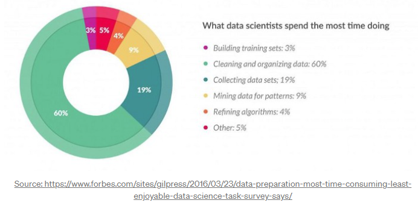
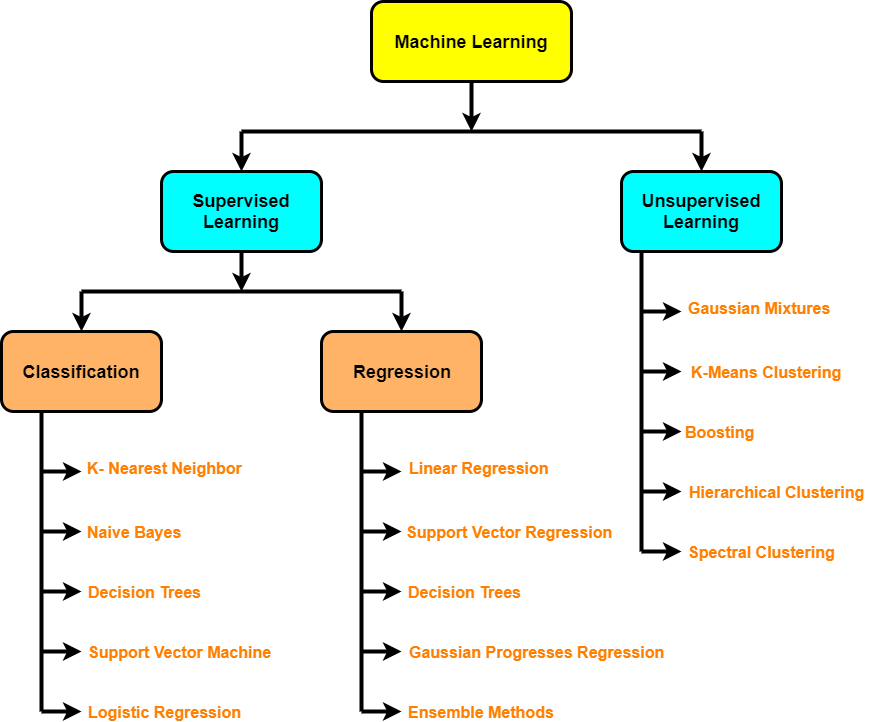
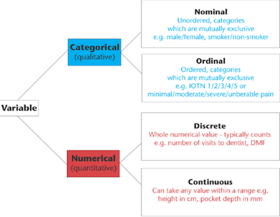
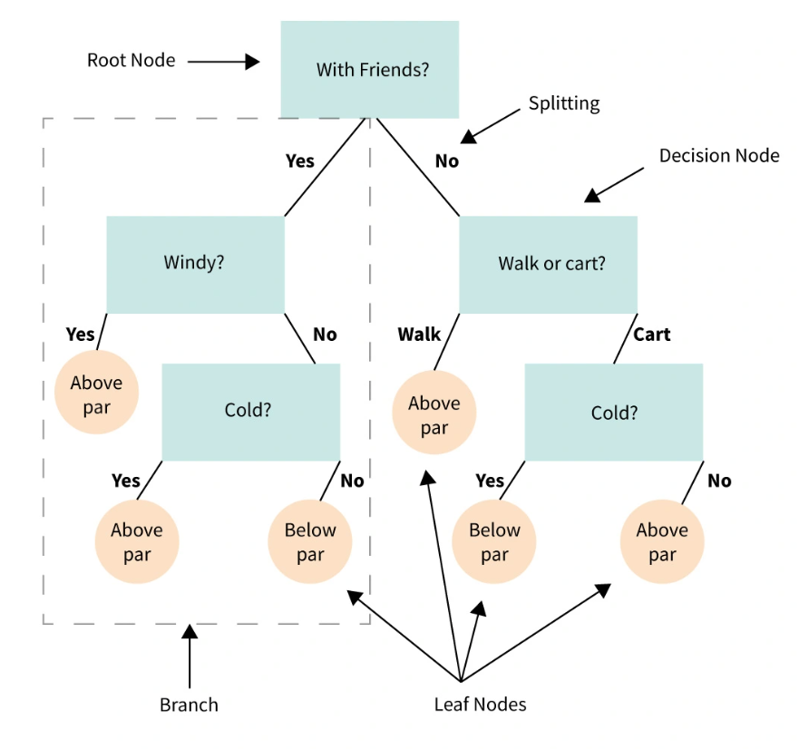
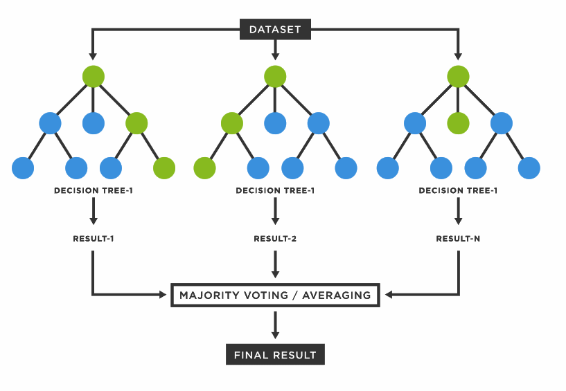
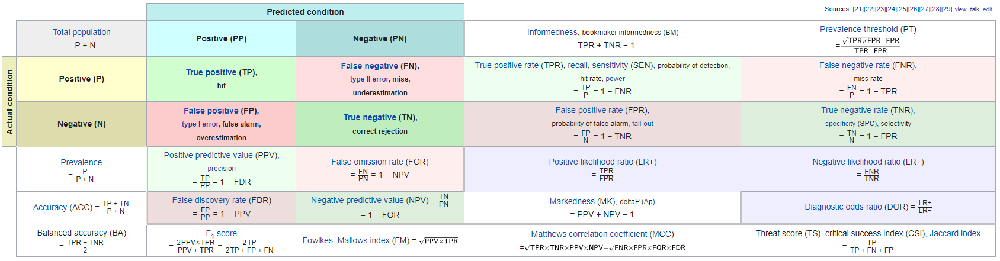

```{r setup, include=FALSE}
library(datasets)
library(ggpubr)
library(rstatix)
library(datasauRus)
library(GGally)
library(titanic)
library(randomForest)
library(caret)
library(tidyverse)
library(cowplot)
set.seed(1234)


# Use set dplyr fxns as priority for conflicts
library(conflicted)
conflict_prefer("select", "dplyr")
conflict_prefer("filter", "dplyr")


```


# Introduction: Datascience for Predictive modeling:

This is not a machine learning class. We will not be covering the wide variety of possible predictive models you could use on your data. Instead, we will be emphasizing both when and how to prepare your data for predictive modeling as well as going over some useful tools which should be in the toolbox of every data scientist.

# What I hope you will remember (if nothing else)

1) **Garbage in, garbage out!**
Machine learning/predictive modeling is built upon the data you give it. A model cannot distinguish between good data, bad data, irrelevant data, and/or completely impossible data. If you ask a model to predict the weather but only give it the dietary habits of bushy-tailed mongooses... The machine trusts you. If you say predict the weather, it will do its best and give you an answer. When the answer is not very good, that may be on you. It is _your_ job as a data scientist to clean and validate your data! (And this is where you spend the majority of your time.)



2) **Know your data!**
Looking at and understanding your data is essential. In order to clean and validate the data correctly, you have to understand each feature in your dataset. In this section we will spend the majority of our time learning when/how to clean and validate our data. That said, cleaning data does not turn bad data into good data. Remember: **garbage in, garbage out.**
Take for example the following 12 datasets. Each of the datasets has identical means and standard deviations and nearly identical correlations.  However when plotted, the structure of the data differs drastically!

```{r}
# https://cran.r-project.org/web/packages/datasauRus/vignettes/Datasaurus.html
datasaurus_dozen %>% group_by(dataset) %>% summarize(
      mean_x    = mean(x),
      mean_y    = mean(y),
      std_dev_x = sd(x),
      std_dev_y = sd(y),
      corr_x_y  = cor(x, y)
    )

datasaurus_dozen %>% 
  ggplot(aes(x = x, y = y, color = dataset)) + 
  geom_point()+
  theme_void()+
  theme(legend.position='none') + 
  facet_wrap(~dataset)

```

# Data and Predictive Modeling:

### Data
- Missing values
  - Imputation
  - Diversity sampling
- Outliers
  - Dropping
  - Capping

- Feature selection
  - duplication/unit-transforms
  - multicollinearity
  - leakage
  
- Feature transformations
  - Non-linear transforms
  - Scaling/normalizing
  
- *denovo* Features
  - Binning
  - Splitting
  - Feature combinations
  
### Predictive modeling
- Over-fitting (generalization error)
  - cross validation (train-test splitting)
  

# 1,000 ft. View of Predictive Modeling / Machine Learning


[ImgLink](https://www.gatevidyalay.com/tag/machine-learning-step-by-step-process/)

### 4 key terms in machine learning

Term | Definition
-----|-----------
Supervised learning | The data is labeled
Unsupervised learning | The data is *not* labeled (looking for structure within data)
Classification | Predicting a categorical/discrete variable
Regression |  Predicting a continuous variable (numerical and linear)

Which model to use?

- Depends on your data and task!

There are many options (and too many to list/describe here), but there are also many helpful resources! 


[ImgLink](https://scikit-learn.org/stable/tutorial/machine_learning_map/index.html)

For our purposes, we will focus on supervised learning and will be implementing a random forest model. I'll talk more about those when we get to the modeling step.

### 4 main types of Features



[imglink](https://statcalculators.com/count-variables-vs-continuous-variables-understanding-the-differences/)
#Ordinal is in order, but scale between items in order might be different

# Let's begin!   
We will go through an example dataset which contains various passenger information for the titanic and talk about how to recognize and clean the dataset correctly.

## Load data / Cursory Examination
```{r class.source = 'fold-show'}
# Load data
df <- titanic_train %>% as_tibble()

# Data structure
df %>% str()    

# Summary Stats
df %>% summary()

# Check for missing values
print(any(is.na(df)))

# Extract rows with missing values
df[!complete.cases(df),]
```

Feature  |	Description	| Key
---------|--------------|--------
survival | Survival	    |0 = No, 1 = Yes
pclass	 | Ticket class	|1 = 1st, 2 = 2nd, 3 = 3rd
sex	     | Sex          |	
Age	     | Age in years	|
sibsp    | # of siblings / spouses aboard the Titanic |	
parch	   | # of parents / children aboard the Titanic	|
ticket	 | Ticket number|	
fare	   |Passenger fare|	
cabin    | Cabin number	|
embarked |Port of Embarkation|	C = Cherbourg, Q = Queenstown, S = Southampton


## Pairplot
This will likely be your bread and butter for dataset cleaning. It gives you a number of plots which may seem daunting, but we'll walk through how to interpret it.
```{r, fig.height=18, fig.width=18, warning=FALSE, message = FALSE}
df %>% 
  select(-Name, -Ticket, -Cabin) %>% # drop highly unique categorical columns 
  ggpairs(aes(color = Sex), progress = F) 

```

# Missing Data

Missing data falls generally into 3 categories: [Missing Data Link](https://stefvanbuuren.name/fimd/sec-MCAR.html)

Type:    | Acronym |  Description: | Reason for missing data:  
---------|---------|---------------|--------------------------
Missing completely at random | MCAR | This cause of this missing data is completely independent of the data itself. | Bad luck 
Missing at random | MAR | Missing data is not random and dependent on other features within dataset | Missing data is explained by observed data  
Missing not at random | MNAR | Reason data is missing is related to features outside the dataset | Not measured, deliberate omission, etc.

A reminder: when you are training a predictive model, it will learn from the data you give it. 

When the data you give it does not represent the population as a whole (i.e. is biased), this tends to produce model generalization errors. There is a field of study dedicated to identifying and correcting diversity sampling issues. That said, we don't have the time to dive down that rabbit hole in detail. Nevertheless, it is important to recognize when data may have diversity sampling issues.

Let's take a look at our titanic dataset and see if we can identify any kind of missing data
```{r, message= FALSE}
df %>% 
  ggplot(aes(x = Age, fill = Sex)) + 
  geom_histogram(alpha = 0.7, binwidth = 2) +
  geom_rug() +
  theme_minimal()

```

Can someone help me interpret our output?

- What do we see?
Spike at age 18

#### Ans:
```{r}
# We got a warning that 177 values contain non-finite values.  As we examined earlier, there are many people who did not have a recorded age.  
```

- What category does most of our missing data fall into?
Late teens/early 20's

#### Ans:
```{r}
# (opinion) I would lean toward MCAR. I think it is unlikely that the reason the ages are omitted has to do with any deliberate omission. My guess is that some of the data was simply "lost" over time.
```

- What do we *not* see? (opinion)
Drop at age 16

#### Ans:
```{r}
# There could be some MNAR occuring withing our Age data:

# A bit of historical digging suggests that 16 was a somewhat significant age at the time. Without too much ado, males over the age of 16 were considered "men" for working purposes while those under that age were still considered "boys" (with legal ramifications for each). Given background checks in 1912 were likely less thorough, I think it is quite possible that our dataset contains a fair number of 15-16 year olds who lied about their age. (That of course is purely conjecture on my part and I don't have any hard evidence)

# On the flip side, you could make the argument that this could simply represent a population level event. Perhaps, 16 year olds were much less likely to want to sail on trans-atlantic voyages.
```

Why am I belaboring this point? Because only when you know your data, can you identify whether or not anomalies such as this are representative or biased. 

While this may seem superfluous for an isolated event such as the titanic, imagine this were the age distribution for a clinical trial. Data different from the population introduces bias into your model. It is part of your job as a data scientist to recognize where this could occur, and correct as much as possible (and by correct I mean get more data in from the correct demographics. Do **NOT** just change data to be what you think is appropriate.)  

So far as the titanic goes, there's not much we can do. This is an isolated event and we won't be expecting our model to be a good approximate of all shipwrecks.

With that said, we can move on to how to handle real missing values.

# Handling Missing Values

Recall that one of the first tests we did was to check for missing values. When we pulled the rows out which had missing entries, the vast majority of the missing entries were for Age. Let's create a flag value for age and add those to our plot.
```{r, message= FALSE}
# Note: unknown age is labeled as 99
FlagAge <- titanic_train %>% as_tibble()

# Age w/ flag
FlagAge$Age[is.na(FlagAge$Age)] <- 99
FlagAge$AgeBin <- ifelse(FlagAge$Age < 18, 'Young', ifelse(FlagAge$Age > 36, 'Old', 'Adult'))

FlagAge %>%
  ggplot(aes(x = Age, fill = AgeBin)) + 
  geom_histogram(alpha = 0.7, binwidth = 2) +
  geom_rug()+
  theme_minimal() + 
  facet_wrap(~Sex)
```

As you can see, there are a large number of missing entries.  What can we do about it? 

I will be following roughly a nice overview which can be found here: [imputationLink](https://towardsdatascience.com/6-different-ways-to-compensate-for-missing-values-data-imputation-with-examples-6022d9ca0779)

Note: We *NOT* be considering observations which are correlated over time here.

Well there are 2 Basic Strategies:

1) **Omission**
- If only a small fraction of your dataset is missing values, it may be easiest to just drop the missing entries.
- Data, as I'm sure you are aware, is often expensive and time consuming to acquire. Is there something else?

2) **Imputation**
- Imputing data is where we guess the missing values of our data set based on other attributes of the data set.  

There are quite a few different strategies for imputing missing data and none of them are perfect. Nevertheless let's go over several methods:

### The easy (but more error prone) methods:

1)  Impute values using the mean/median.
This methods imputes the missing value as the mean or median of the group. This does not need to be mean of all your values, but it is acceptable to use group means if it looks like you have different sub populations in your data. 

In general, I would recommend using the mean if your data is parametric and using the median if it is non-parametric. 

-- Warning! Do **NOT** use this method with categorical features
If you have categories 1, 2, and 3, taking the average and filling missing values in as 2.5 usually has poor performance.

2) Impute values using the most frequent response

- This approach works with categorical variables and works best when the category is biased towards one response.

For example if 90% of your dataset belongs to a class "non-smoker", this approach will impute missing values as non-smoker. As you can imagine, this technique doesn't perform as well when a result is 50/50 and does introduce bias into dataset.

3) Zero or constant imputation

This can be very useful for certain types of data, but again has the potential to be highly biased. 

Think of any medical form which has an "other" box. When that gets read into the table, if the box is empty it will likely get read in as "missing." In this case it makes a lot of sense to set all these "missing" values to 0 or some other flag constant.  

**NOTE** Sometimes datasets will already have flag values built into the dataset. For example, four our titanic passenger dataset, several passengers have a Fare which equals 0.  Is this legitimate?  Constant imputation could be a valid imputation method for these values (Such as setting the fare to the lowest cost ticket or perhaps the average price based on the passenger's class) 

I recommend using this technique only in specific circumstances like those mentioned above. Simply changing values in your dataset has the potential to bias your dataset

### The more complicated but potentially less error prone methods:

- Predictive models for your predictive models.

Yes, it is a legitimate technique to build a predictive model to predict your missing data which can then be used to build a separate predictive model. This type of imputation gets very complicated very quickly and I wouldn't recommend using it unless you know you need to.

That said, you can use basically any predictive model (to name a few):

- Linear/logistic regression
- k-Nearest Neighbors
- Neural networks
- etc ...

The pros of these models is they can produce better results, but again take more knowledge and time to build, implement, and debug.  

I would (highly) recommend sticking to the first 3 methods for now. 
  
- I demonstrate a reduced version stochastic regression imputation with multiple input columns to show how some techniques can be used to help preserve your sampled distribution. 

See Also:

If you are dealing with a lot of missing data, look into the *mice* package in R: 

- [mice package](https://www.rdocumentation.org/packages/mice/versions/3.14.0/topics/mice)
- [mice publication](https://www.jstatsoft.org/article/view/v045i03)

## Omitting values
```{r, message= FALSE}
# Omission 
omissionEx <- titanic_train %>% as_tibble() %>% drop_na()

omissionEx %>%
  ggplot(aes(x = Age, fill = factor(Pclass))) + 
  geom_histogram(alpha = 0.7, binwidth = 2) +
  geom_rug()+
  theme_minimal() + 
  facet_wrap(~Sex)

```

## Imputing missing from mean:
```{r, message= FALSE}
# Imputing Age: Mean of column
imputeAge_mean <- titanic_train %>% as_tibble() %>%
  mutate(impAge = ifelse(is.na(Age), mean(Age, na.rm = TRUE), Age))

imputeAge_mean %>%
  ggplot(aes(x = impAge, fill = factor(Pclass))) + 
  geom_histogram(alpha = 0.7, binwidth = 2) +
  geom_rug()+
  theme_minimal() + 
  facet_wrap(~Sex)

```


## Imputing missing from median:
```{r, message= FALSE}
# Imputing Age: Mean of column
imputeAge_median <- titanic_train %>% as_tibble() %>%
  mutate(impAge = ifelse(is.na(Age), median(Age, na.rm = TRUE), Age))

imputeAge_median %>%
  ggplot(aes(x = impAge, fill = factor(Pclass))) + 
  geom_histogram(alpha = 0.7, binwidth = 2) +
  geom_rug()+
  theme_minimal() + 
  facet_wrap(~Sex)

```

## Mean imputation by group (slightly more complicated):

```{r, message= FALSE}
titanic_train %>% as_tibble() %>% rename('SES' = Pclass) %>% select(PassengerId, Age, Sex, SES) %>%
  group_by(Sex, SES) %>%
  mutate(meanAge = mean(Age, na.rm = TRUE), sdAge = sd(Age, na.rm = TRUE), numNA = sum(is.na(Age)) ) %>%
  ungroup() %>%
  group_by(Sex, SES, meanAge, sdAge) %>%
  mutate(Age = ifelse(is.na(Age), meanAge, Age)) %>%
  ungroup() %>%
  ggplot(aes(x = Age, fill = factor(SES))) + 
  geom_histogram(alpha = 0.7, binwidth = 2) +
  labs(title = 'Mean imputation by group') +
  geom_rug()+
  theme_minimal() + 
  facet_wrap(~Sex)

```


```{r, echo = FALSE, fig.show = 'hide', results = 'hide', message=FALSE, warning=FALSE}
imputeAge <- titanic_train %>% as_tibble() %>% rename('SES' = Pclass)
# Get mean/sd for age:
imputeAge %>% select(Sex, Age) %>% group_by(Sex) %>% drop_na() %>% summarize(meanAge = mean(Age), sdAge = sd(Age))
# How should we impute?  Should we impute by the average age of the whole dataset?  Impute by average of each sex? of each age group?

# Approx. Parametric
imputeAge %>% ggqqplot('Age')
imputeAge %>% filter(Sex == 'female') %>% ggqqplot('Age')
imputeAge %>% filter(Sex == 'male') %>% ggqqplot('Age')

# Indeed, the age is significantly lower for the female group -- suggesting we should impute female and male ages separately
imputeAge %>% t_test(Age ~ Sex)

# Are there any other factors?
imputeAge %>% ggqqplot('Age')
imputeAge %>% filter(SES == '1') %>% ggqqplot('Age')
imputeAge %>% filter(SES == '2') %>% ggqqplot('Age')
imputeAge %>% filter(SES == '3') %>% ggqqplot('Age')

imputeAge %>% group_by(SES) %>% drop_na() %>% summarize(meanAge = mean(Age), sdAge = sd(Age)) 

# Only normal for 1st class
imputeAge %>% group_by(SES) %>% drop_na() %>% shapiro_test(Age)

# 3 variables now: So Kruskal wallis -- suggesting that I should also adjust for class(i.e. SES)
imputeAge %>% kruskal_test(Age ~ SES)
imputeAge %>% wilcox_test(Age ~ SES)

# So let's impute values for age based on sex and SES
imputeAge <- titanic_train %>% as_tibble() %>% rename('SES' = Pclass) %>% select(PassengerId, Age, Sex, SES) %>%
  group_by(Sex, SES) %>%
  mutate(meanAge = mean(Age, na.rm = TRUE), sdAge = sd(Age, na.rm = TRUE), numNA = sum(is.na(Age)) ) %>%
  ungroup() %>%
  group_by(Sex, SES, meanAge, sdAge) %>%
  mutate(Age = ifelse(is.na(Age), rnorm(numNA, mean = meanAge, sd = sdAge), Age) ) %>%
  ungroup()

# There are some negative ages now.  Is this okay? (maybe... for a continuous variable may be okay, let's just say if we got unlucky, use the group mean value instead)
imputeAge <-imputeAge %>% mutate(Age2 = ifelse(Age < 0, meanAge, Age))
imputeAge$AgeBin <-  factor(ifelse(imputeAge$Age2 < 18, 'Young', ifelse(imputeAge$Age2 > 36, 'Old', 'Adult')), levels = c('Young', 'Old', 'Adult'))


```

I group by terms by SES and Sex and then impute the values as samples from the normal distribution of each of the subgroups (then correct for negative values.)

```{r, fig.height = 12}
p1 <- omissionEx %>%
  ggplot(aes(x = Age, fill = factor(Pclass))) + 
  geom_histogram(alpha = 0.7, binwidth = 2) +
  geom_rug()+
  labs(title = 'Omission model') + 
  theme_minimal() + 
  facet_wrap(~Sex)

p2 <- imputeAge_mean %>%
  ggplot(aes(x = impAge, fill = factor(Pclass))) + 
  geom_histogram(alpha = 0.7, binwidth = 2) +
  geom_rug()+
  labs(title = 'Mean imputation') +
  theme_minimal() + 
  facet_wrap(~Sex)

p3 <- imputeAge %>%
  ggplot(aes(x = Age2, fill = factor(SES))) + 
  geom_histogram(alpha = 0.7, binwidth = 2) +
  geom_rug()+
  labs(title = 'More fancy imputation model') + 
  theme_minimal() + 
  facet_wrap(~Sex)

plot_grid(p1, p2, p3, labels = 'AUTO',ncol = 1)

```

# Standardization, Normalization, and Scaling

Scaling/normalization is essential for some predictive models, while for others it has only marginal effects. 

To paraphrase an article [link]: https://www.analyticsvidhya.com/blog/2020/04/feature-scaling-machine-learning-normalization-standardization/

> As a general rule of thumb, any form of predictive modeling which relies on gradient descent (i.e. linear regression, logistic regression, neural networks) or a distance metric (kNN, k-means, support vector machines) tends to perform better with scaled variables.

While the terminology is frustratingly inconsistent, there are three key techniques you should be aware of:

1) Standard scaler (i.e. mean/variance scaling)
2) Robust scaler (i.e. median/IQR scaling)
3) min-max normalization


## The Standard Scaler:

This technique is likely one you've already know/have encountered.

$\frac{x_{i} - \mu}{\sigma}$

This technique centers your data around zero unit variance (is equivalent to getting a z-score for your data). Note, this transform preserves distribution of your data and is most useful with data which is roughly Gaussian.

The standard scaler can either be implemented manually using the formula above, or by using the "scale" function in R.

```{r, fig.width = 12, fig.height=12, message = FALSE}
df <- titanic_train %>% as_tibble() %>% rename('SES' = Pclass) %>% left_join(imputeAge %>% select(PassengerId, Age2, AgeBin), by = 'PassengerId')
scaleDF <- df %>% select(Age2, Fare, Sex, SES)

scaleDF <- scaleDF %>%
  mutate(StandardScalerAge_v1 = scale(Age2),
         StandardScalerAge_v2 = (Age2 - mean(Age2))/sd(Age2) )

rawAgePlot <- scaleDF %>%
  ggplot(aes(x = Age2, fill = factor(SES))) + 
  geom_histogram(alpha = 0.7, bins = 30) +
  geom_rug()+
  labs(title = 'Unscaled') + 
  theme_minimal() +
  facet_wrap(~Sex)

ssv1AgePlot <- scaleDF %>%
  ggplot(aes(x = StandardScalerAge_v1, fill = factor(SES))) + 
  geom_histogram(alpha = 0.7, bins = 30) +
  geom_rug()+
  labs(title = 'Standard Scaler v1') + 
  theme_minimal() +
  facet_wrap(~Sex)

ssv2AgePlot <- scaleDF %>%
  ggplot(aes(x = StandardScalerAge_v2, fill = factor(SES))) + 
  geom_histogram(alpha = 0.7, bins = 30) +
  geom_rug()+
  labs(title = 'Standard Scaler v2') + 
  theme_minimal() +
  facet_wrap(~Sex)  
  
# Note how the distribution of the points is unchanged.
plot_grid(rawAgePlot, ggqqplot(scaleDF, 'Age2'),
          ssv1AgePlot, ggqqplot(scaleDF, 'StandardScalerAge_v1'),
          ssv2AgePlot,ggqqplot(scaleDF, 'StandardScalerAge_v2'), 
          labels = 'AUTO', ncol = 2)

```

## The Robust Scaler:

$\frac{x_{i} - median(x)}{IQR}$

This technique centers your data around your median rather than your mean. Of note, it works better with skewed data as the median/IQR tends to be more resistant to outliers

```{r, fig.width = 12, fig.height=12, message = FALSE}
scaleDF <- scaleDF %>%
  mutate(RobustScalerAge_v1 = (Age2 - median(Age2))/IQR(Age2))

rsv1AgePlot <- scaleDF %>%
  ggplot(aes(x = StandardScalerAge_v1, fill = factor(SES))) + 
  geom_histogram(alpha = 0.7, bins = 30) +
  geom_rug()+
  labs(title = 'Robust Scaler') + 
  theme_minimal() +
  facet_wrap(~Sex)
  
# Note how the distribution of the points is unchanged.
plot_grid(rawAgePlot, ggqqplot(scaleDF, 'Age2'),
          rsv1AgePlot, ggqqplot(scaleDF, 'RobustScalerAge_v1'),
          labels = 'AUTO', ncol = 2)
```

## min-max normalization

$\frac{x_{i} - min(x)}{max(x) - min(x)}$

This transform normalizes all values between 0 and 1 and can be used when your data does not follow a normal distribution. A word of caution, this transform is particularly vulnerable to extreme outliers in your data.

```{r, fig.width = 12, fig.height=12, message = FALSE}
scaleDF <- scaleDF %>%
  mutate(MinMaxNormAge_v1 = (Age2 - min(Age2))/( max(Age2) - min(Age2)) )

mmnv1AgePlot <- scaleDF %>%
  ggplot(aes(x = MinMaxNormAge_v1, fill = factor(SES))) + 
  geom_histogram(alpha = 0.7, bins = 30) +
  geom_rug()+
  labs(title = 'Min-Max Normalization') + 
  theme_minimal() +
  facet_wrap(~Sex)

plot_grid(rawAgePlot, ggqqplot(scaleDF, 'Age2'),
          mmnv1AgePlot, ggqqplot(scaleDF, 'MinMaxNormAge_v1'),
          labels = 'AUTO', ncol = 2)

```

## All methods side-by-side: 

```{r, fig.width = 12, fig.height=12, message = FALSE}
plot_grid(rawAgePlot, ggqqplot(scaleDF, 'Age2'),
          ssv1AgePlot, ggqqplot(scaleDF, 'StandardScalerAge_v1'),
          rsv1AgePlot, ggqqplot(scaleDF, 'RobustScalerAge_v1'),
          mmnv1AgePlot, ggqqplot(scaleDF, 'MinMaxNormAge_v1'),
          labels = 'AUTO', ncol = 2)
```

# Dummifying Categorical variables

Dummifying data is where you take a categorical column with n categories and transform it into n-1 features composed of only 0s and 1s. More often than not, this is done automatically by R when you give it factor datatypes. But could be done manually should you desire.  This is analogous to the binning procedure we saw earlier for a discrete variable.

```{r}
# Discrete dummification
df %>% mutate(SibSpBin = factor(ifelse(SibSp == 0, 0, 1))) %>% select(PassengerId, Name, Age, SibSp, SibSpBin) %>% head(10)
```

# Transformations

```{r, fig.width = 12, fig.height=6, message = FALSE}
transformPlot1 <- df %>%
  ggplot(aes(x = Fare, fill = as_factor(SES))) + 
  geom_histogram(alpha = 0.7, binwidth = 5) +
  geom_rug()+
  theme_minimal()+
  labs(title = 'Untransformed - Fare')

plot_grid(transformPlot1, ggqqplot(df, 'Fare'),
          labels = 'AUTO', ncol = 2)

```

Take a look at the Fare feature (shown above).  As you can see it is heavily skewed.

Transformations are a way of making heavily skewed data (which can impair model performance) more evenly distributed across a range of values. 

Common types of transforms:

- Log 
  - regardless of base (2, 10, or e) the spread is unchanged
- sqrt (cubic, 4th roots also valid but less common)
- inverse (1/value)

> Warning! If your data contains zeros log and inverse transforms will produce infinite and undefined values respectively. Adding one to each value of the dataset is a common for log transforms.

An alternative means of ensuring non-zero values for transforms is by setting a lower bound. I.e. making all 0s equal to smallest non-zero entry.

```{r, fig.width = 12, fig.height=18, message = FALSE}
# Log2(value+1)
transLog2Plot <- df %>%
  ggplot(aes(x = log2(Fare+1), fill = as_factor(SES))) + 
  geom_histogram(alpha = 0.7) +
  geom_rug()+
  labs(title = 'log2(Fare+1)') + 
  theme_minimal() 

# ln(value+1)
transLnPlot <-df %>%
  ggplot(aes(x = log(Fare+1), fill = as_factor(SES))) + 
  geom_histogram(alpha = 0.7) +
  geom_rug()+
  labs(title = 'ln(Fare+1)') + 
  theme_minimal() 

# Log10(value+1)
transLog10Plot <- df %>%
  ggplot(aes(x = log10(Fare+1), fill = as_factor(SES))) + 
  geom_histogram(alpha = 0.7) +
  geom_rug()+
  labs(title = 'log10(Fare+1)') + 
  theme_minimal()

# sqrt(value)
transSqrtPlot <- df %>%
  ggplot(aes(x = sqrt(Fare), fill = as_factor(SES))) + 
  geom_histogram(alpha = 0.7) +
  geom_rug()+
  labs(title = 'sqrt(Fare)') + 
  theme_minimal() 

# 1/(value + 1)
transInversePlot <- df %>%
  ggplot(aes(x = 1/(Fare+1), fill = as_factor(SES))) + 
  geom_histogram(alpha = 0.7) +
  geom_rug()+
  labs(title = '1/(Fare+1)') + 
  theme_minimal() 

plot_grid(transformPlot1, transLog2Plot, transLnPlot, transLog10Plot, transSqrtPlot, transInversePlot,
          labels = 'AUTO', ncol = 2)

```

# Model Cross-validation: 

Allow me to pose a question: Do we ever want a machine learning accuracy of 100%?

99.9% of the time I would argue that no, this is not a good thing as it suggests something went wrong. Specifically, over-fitting of the data, or feature leakage. For now we will focus on **over-fitting**.

To give a realistic example, imagine one student who studies for an exam by reading the text book, reading lecture notes, etc. and another student who simply memorized the answers to the exam. Say the first student gets a 90% while the second student gets 100% on this first exam. Say then that the final for this class is cumulative and the second student was unable to get the final to memorize the answers.  

Which approach is better?

**over-fitting** is the machine learning equivalent of memorizing the answers to the exam. When a model is over-fit on the data it tends to have a high performance score on the training data, but poor performance on testing data. This phenomenon is known as generalization error.

One common methodology to help gauge whether your model is over-fitting the data is by doing **cross-validation**.

The essence of **cross-validation** is to split your dataset into a training and a testing set (usually 70-80% is used for training and the remainder for testing). Your model's performance difference on the training vs. the testing set allows you to get an idea of whether your model is over-fitting.

There are several methods of cross validation which attempt to make the distributions of your training set as similar to your testing set as possible.  We will not go over those methods here. We will stick with the simplest implementation which is to just randomly set aside 20% of our dataset for testing. 

Note: Random forests are special amongst predictive models as they have train-test splitting built into their architecture! Nevertheless, this is the exception and not the rule so we will be manually doing the train-test split.

```{r}
# Basic train test splitting
regDF <- titanic_train %>% 
  as_tibble() %>% 
  select(-Name, -Cabin, -Ticket) %>%
  filter(Embarked != "") %>% 
  transform( 
    Survived = as.factor(Survived),
    Pclass = as.factor(Pclass),
    Sex = as.factor(Sex),
    Embarked = as.factor(Embarked)
  ) %>% 
  drop_na()

train <- regDF %>% dplyr::sample_frac(0.80)
test  <- dplyr::anti_join(regDF, train, by = 'PassengerId')

train %>% str()
```

# Feature leakage:

Feature leakage is another means by which your predictive model can get an unrealistically high performance.  In essence, feature leakage is when your model has access to information during training that it would not have access too during test performance.

Let's take a model for example where we want to predict whether a passenger is young, adult, or old

```{r, echo = FALSE}
df_train <- df %>% select(-PassengerId, -Name, -Cabin, -Ticket, -Age) %>% drop_na()
df_train <- df_train %>%
  filter(Embarked != "") %>%
  transform( 
    Survived = as.factor(Survived),
    SES = as.factor(SES),
    Sex = as.factor(Sex),
    Embarked = as.factor(Embarked),
    AgeBin = as.factor(AgeBin)
  )

df_X <- df_train %>% select(-AgeBin)
df_y <- df_train$AgeBin

rfReg <- randomForest(x = df_X, y = df_y, ntree = 500) 

y_pred <- predict(rfReg, newData = titanic_test)

confusionMat <- confusionMatrix(df_y, y_pred)
confusionMat
```

WOW! We got 99.6% accuracy! Isn't that amazing?  

Well not really. It is instead an example of feature leakage. In the real world, if we are attempting to predict how old someone is, we probably don't have access to how old they are.  

While this may be an obvious example, feature leakage can be much more subtle.

Take for example a clinical trial where participants come in repeatedly for MRIs.  The goal of the model is to use the MRI data to predict whether the patient will develop Alzheimer's disease.  

What do you think will happen if you do as we did above and simply set 80% of our MRI scans in the training group?

- likely, because patients get multiple scans, the model will partially memorize patients.

What about scaling data?

Should you scale your data before or after train-test splitting? 

#### Answer:
```{r}
# AFTER!  If you scale your data before splitting you can bias your data.  This is also known as premature featurization.
```

Overall, feature leakage is a tricky problem because it is not always obvious when it is occurring. It is up to *you* to ensure your dataset is void of leaky features! 

Want to try 1 of 3 things before moving to deep learning
1) Linear regression model
2) Random Forests
3) 

# Random Forests

We're almost there! After painstakingly preparing our dataset we are finally ready to begin talking about our predictive model of choice: the random forest.

Why random forests?

To steal some of the benefits from: https://www.stat.berkeley.edu/~breiman/RandomForests/cc_home.htm#:~:text=In%20random%20forests%2C%20there%20is,sample%20from%20the%20original%20data.

**Features of Random Forests: **

- It is unexcelled in accuracy among current algorithms.
- It runs efficiently on large data bases.
- It can handle thousands of input variables without variable deletion.
- It gives estimates of what variables are important in the classification.
- It generates an internal unbiased estimate of the generalization error as the forest building progresses.
- It has an effective method for estimating missing data and maintains accuracy when a large proportion of the data are missing.
- It has methods for balancing error in class population unbalanced data sets.
- Generated forests can be saved for future use on other data.
- Prototypes are computed that give information about the relation between the variables and the classification.
- It computes proximities between pairs of cases that can be used in clustering, locating outliers, or (by scaling) give interesting views of the data.
- The capabilities of the above can be extended to unlabeled data, leading to unsupervised clustering, data views and outlier detection.
- It offers an experimental method for detecting variable interactions.

Basically if there is one predictive model you should know, its the random forest. It provides the best "bang for your buck" particularly with regards to effort.

To summarize in my own words, random forests tend to have good accuracy, do train-test splitting for you, can do both classification and regression, and can handle large datasets relatively efficiently. 

## How a Decision Tree Works

Image from: https://www.mastersindatascience.org/learning/machine-learning-algorithms/decision-tree/


Random forests are built on decision trees so let's start there.

Decision trees are likely something you are familiar with at least (at least conceptually). Essentially a series of decisions divides our data repeatedly until we reach a final answer. 

How is a decision made? 

Well without diving into the math, the model will attempt to maximize the information gained by each decision. Practically speaking, imagine a model is supposed to look at an image and determine whether a person is about to run a marathon. The model is able to determine the height, weight, gender, hair, jewelry, clothing, shoes, etc. of the person in the photo. Of all these features, which is the *MOST* likely to give the most information? Is height of the person going to help separate the two groups? what about weight? what about type of shoes?

At least for my hypothetical example, let's say 98% of our people who are about to run a marathon are wearing running shoes.  The decision tree will make a split the dataset based on this feature and then repeat the process. 

There are a number of hyperparameters you can adjust in your decision tree (such as tree height, number of branches, etc.) but we won't discuss those here.  

## Random Forests

Image from: https://www.tibco.com/reference-center/what-is-a-random-forest


Random forests are what we call an *ensemble* model composed of decision trees. 

What if, instead of giving your whole dataset to one decision tree, you chop up your dataset into many overlapping pieces and give each one to a different decision tree. At the end, each tree gets to vote. The class with the majority of votes is the the predicted class. (regression works similarly, except each tree's output is averaged).  

That's really all there is to it.

# Implementing a random forest:

Let's begin by making a classifier to predict whether a passenger survived the titanic.

**NOTE:** While random forest automatically train-test splits, we will be doing this manually.

```{r, echo = FALSE, fig.show = 'hide', results = 'hide', message=FALSE, warning=FALSE}
train_X <- df_train %>% select(-Survived)
train_y <- df_train$Survived

test_X <- titanic_test %>% select(-PassengerId, -Name, -Cabin, -Ticket) 
test_X$Fare[is.na(test_X$Fare)] <- 0

test_X <- test_X %>%
  group_by(Sex, Pclass) %>%
  mutate(meanAge = mean(Age, na.rm = TRUE), sdAge = sd(Age, na.rm = TRUE), numNA = sum(is.na(Age)) ) %>%
  ungroup() %>%
  group_by(Sex, Pclass, meanAge, sdAge) %>%
  mutate(Age = ifelse(is.na(Age), rnorm(numNA, mean = meanAge, sd = sdAge), Age) ) %>%
  ungroup() %>% 
  mutate(Age2 = ifelse(Age < 0, meanAge, Age)) %>%
  group_by(Pclass) %>% 
  mutate('meanLogFareBySES' = mean(log(Fare+1))) %>%
  ungroup() %>%
  mutate('LogFare' = ifelse((Fare == 0), meanLogFareBySES, log(Fare))) %>%
  transform(
    AgeBin = factor(ifelse(Age2 < 18, 'Young', ifelse(Age2, 'Old', 'Adult')), levels = c('Young', 'Old', 'Adult')),
    AgeScaled = scale(Age2),
    SES = as.factor(Pclass),
    Sex = as.factor(Sex),
    Embarked = as.factor(Embarked)
                     
  ) %>% select(SES, everything(), -LogFare,-Age, -AgeScaled, -meanAge, -sdAge, -numNA, -meanLogFareBySES, -Pclass)

test_y <- factor(titanic::titanic_gender_model$Survived, levels = c('0', '1'))

df_test <- test_X %>% mutate(Survived = test_y)
```

## Method 1:
Want about ~80% in training for ~20-30% in outside set
Very fast with only 500 trees
```{r class.source = 'fold-show'}
train_X %>% str()
train_y %>% str()
test_X %>% str()
test_y %>% str()

rfClassifier <- randomForest(x = train_X, y = train_y, ntree = 500) 
rfClassifier

y_pred_train <- predict(rfClassifier)
y_pred_test <- predict(rfClassifier, newdata = test_X)
```
OOB= out of bag (estimated error rate). On average, if picked random tree, how likely is it wrong
Column= Predicted Value
Row= True value
00= Predicted they would survive, and they did
01= False Positive
10= False Negative
11= Predicted they would not survive, and they didn't
Want 00 and 11 values high, because means you predicted well

## Method 2: 
Does the same thing, just different syntax
Good for neural network bc can be more generalized outside of R
```{r class.source = 'fold-show'}
df_train %>% str()

rfClassifier <- randomForest(Survived ~ ., data = df_train, ntree = 500) 
rfClassifier
y_pred_train <- predict(rfClassifier)
y_pred_test <- predict(rfClassifier, newdata = test_X)
```

# Model Performance
```{r}
rfClassifier
plot(rfClassifier)
varImp(rfClassifier)
varImpPlot(rfClassifier)

print('Training Confusion matrix')
confusionMatTrain <- confusionMatrix(df_train$Survived, y_pred_train)
confusionMatTrain
print('Test Confusion matrix')
confusionMatTest <- confusionMatrix(test_y, y_pred_test)
confusionMatTest

```
If not a lot of variability in error chart, probably need more trees
High accuracy doesn't mean much if no info rate is higher and high p-value
Two metrix to look at for predictive model
1) F1 score (combines sensitivity and specificity)
2) Balanced accuracy
Accuracy isn't really looked at

##The Confusion Matrix: 

Image from: https://en.wikipedia.org/wiki/Confusion_matrix



# What about Regression? (Fare/Ticket price)
```{r class.source = 'fold-show'}
# Set up X and y 
regtrain_X <- train %>% select(-Fare, -PassengerId)
regtrain_y <- train$Fare
regtest_X <- test %>% select(-Fare, -PassengerId)
regtest_y <- test$Fare

# View to double check
regtrain_X %>% str()
regtrain_y %>% str()
regtest_X %>% str()
regtest_y %>% str()

# Train the model
rfReg <- randomForest(x = regtrain_X, y = regtrain_y, ntree = 500, importance = TRUE)
y_regpred <- predict(rfReg, newData = regtest_X)

# Examine the model
rfReg
plot(rfReg)
importance(rfReg)
varImpPlot(rfReg)

```
Looks at data type to determine classification or regression
If were doing ages, using regression would get you output of half survival
Removing "class" variable increases your error, therefore it is importance to data (further to right on plot, more important)
# Resources:

### Regression with categorical variables
- https://advstats.psychstat.org/book/mregression/catpredictor.php

### Scaling/Normalizaing
- https://www.analyticsvidhya.com/blog/2020/04/feature-scaling-machine-learning-normalization-standardization/

### Feature engineering
- https://towardsdatascience.com/feature-engineering-for-machine-learning-3a5e293a5114
Pretty solid overview of feature engineering for ML (note it is written for python)

### Imputation
- https://towardsdatascience.com/6-different-ways-to-compensate-for-missing-values-data-imputation-with-examples-6022d9ca0779
- https://bookdown.org/mike/data_analysis/imputation-missing-data.html

### Random Forests
https://medium.com/analytics-vidhya/ensemble-models-bagging-boosting-c33706db0b0b
https://towardsdatascience.com/a-quick-and-dirty-guide-to-random-forest-regression-52ca0af157f8#:~:text=Random%20forest%20is%20a%20type,prediction%20of%20the%20individual%20trees.
https://towardsdatascience.com/random-forest-regression-5f605132d19d

# Session info:
```{r}
sessionInfo()
```