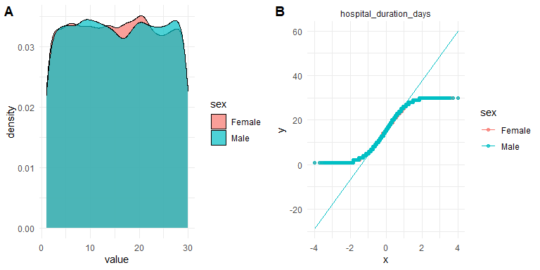
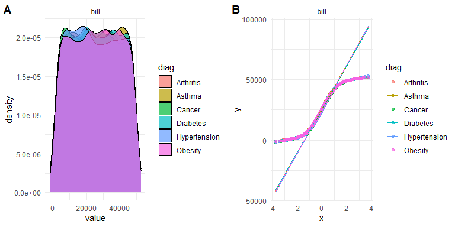

```{r setup, include=FALSE}
library(ggpubr)
library(rstatix)
library(datasauRus)
library(GGally)
library(titanic)
library(randomForest)
library(caret)
library(MASS)
library(car)
library(tidyverse)
set.seed(1234)

# Use set dplyr fxns as priority for conflicts
library(conflicted)
conflict_prefer("select", "dplyr")
conflict_prefer("filter", "dplyr")

data_path <- "data/healthcare.csv"

```


# Ex 1: Fundamentals
1) load in your data from the given `data_path`
2) Use the meta-data to do reformat your data (if necessary)
3) Obtain basic info about summary statistics, structure, and missing values
```{r}
print(data_path)

```

## Ex 1.2: Data wrangling
1) Check if there are any repeated measurements in your dataset
  Hint: There are. But how can you show this?
2) Create two new columns
  one which keeps a count of the total number of repeated measurements
  one which contains the total duration of the patient's stay in the hospital.
    Name it: `hospital_duration_days`
3) Create a new tibble containing only observations *without* repeated measurements.


```{r}

```

## Ex 1.3: Visualization
1) Take the subset *without* repeated measures AND
  select only `hospital_duration_days` and `Gender` columns AND
  convert the data into `long` format.

2) Using the long format dataset you just created make two plots
  A density plot
  A QQ plot
  
  Color both plots by `Gender`.

Repeat the above two steps for `Hospital Bill` and `Medical Condition` columns.
  Color both plots by `Medical Condition`

Your results should look something like this:



```{r, fig.height=4, fig.width = 8, message = FALSE, warning = FALSE}


```

```{r, fig.height=4, fig.width = 8, message = FALSE, warning = FALSE}


```

## Ex 1.4: Statistics
Identify and perform the correct statistical test for the following scenarios:

For individuals with only one hospital visit, test:
1) IV: `Gender` DV: `hospital_duration_days`
2) IV: `Medical Condition` DV: `Hospital Bill`
3) `Blood Type` and `Medication`
  - First make a table from the two columns
  - Perform the correct statistical test on this frequency table

```{r}

```


